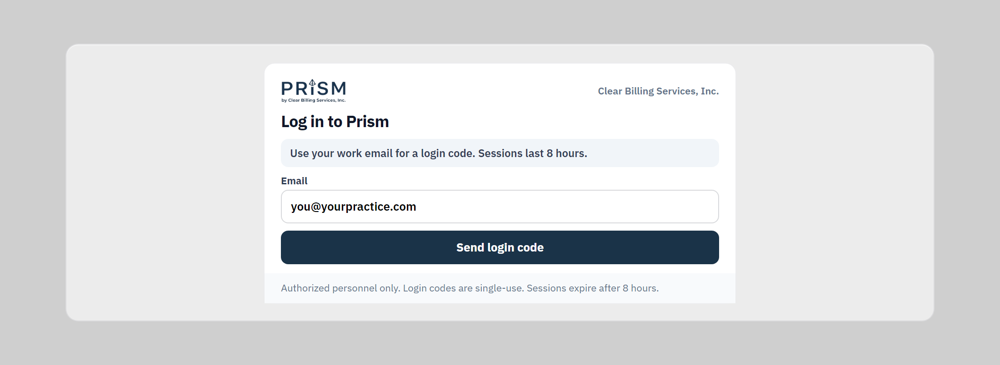
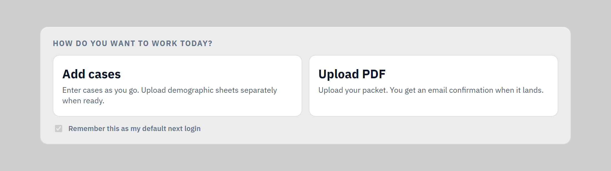
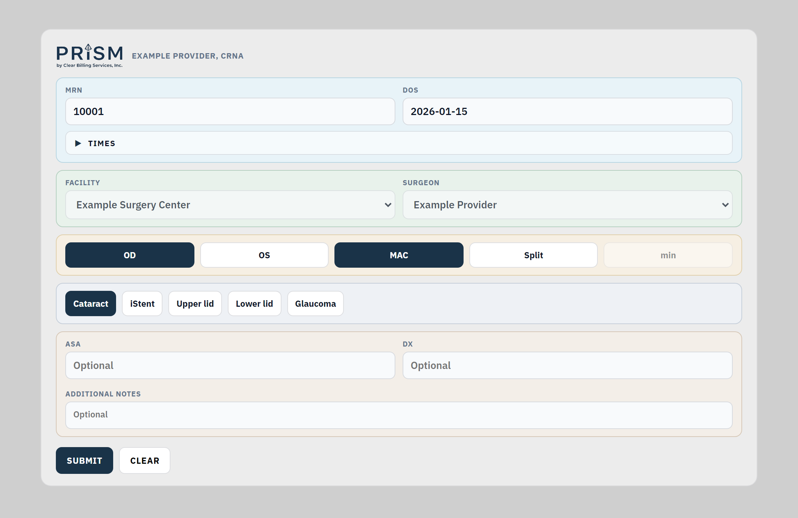
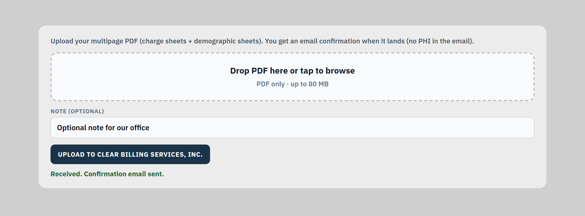

# ClearBilling · Prism Clinician Intake (Demo)

**Synthetic data only. Not for clinical use. Not connected to production PHI.**

Interactive GitHub Pages demo of **Prism**, Clear Billing’s HIPAA-oriented clinician intake portal for anesthesia practices.

## Open the demo

**https://brivera2005.github.io/clinician-mobile-intake/**

Or open [`index.html`](./index.html) locally.

## What Prism does

1. **Sign in** with an invited work email + Cloudflare Access login code (8-hour sessions).
2. **Accept the PHI screen** before working.
3. **Add Case** through the day (MRN, DOS, facility, surgeon, eye/procedure, optional ASA/DX/notes; Times collapsed until needed).
4. **Or Upload PDF** for a bulk handwritten packet (charges + demos) instead of email.
5. **Demographics sync later by MRN** so case capture does not wait on face sheets.

Production URL for invited practices: `https://prism.clearbillingservices.com` (not this public demo).

## Screenshots

Desktop screenshots · synthetic data, not live examples:

| | |
|---|---|
|  |  |
|  |  |

## Documentation

- [Provider guide (PDF)](docs/Prism-Provider-Guide.pdf) - practice-facing handout
- [HIPAA & security](docs/HIPAA-AND-SECURITY.md) - program + live technical safeguards

## UL / LL

In the live form these are labeled **Upper lid** / **Lower lid** (lid procedures).

## Pair with Command Center (portfolio)

Downstream coding / operator desk demo:

- Flagship: https://github.com/brivera2005/command-center-demo
- Operator guide: https://github.com/brivera2005/command-center-demo/blob/main/docs/OPERATOR_GUIDE.md
- Portfolio index: https://github.com/brivera2005/healthcare-portfolio

## Author

Benjamin M. Rivera · Clear Billing Services, Inc.  
LinkedIn: https://linkedin.com/in/brivera2005  
Email: brivera2005@gmail.com

## License

MIT
