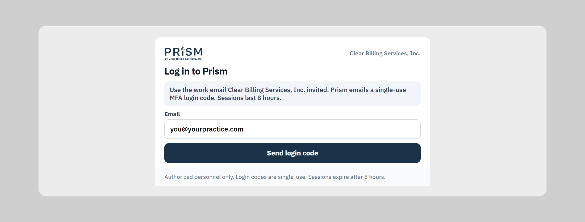
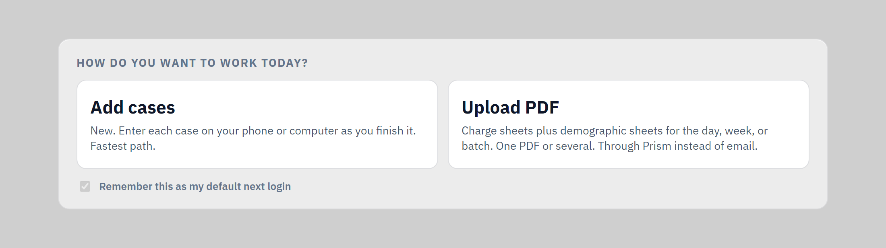
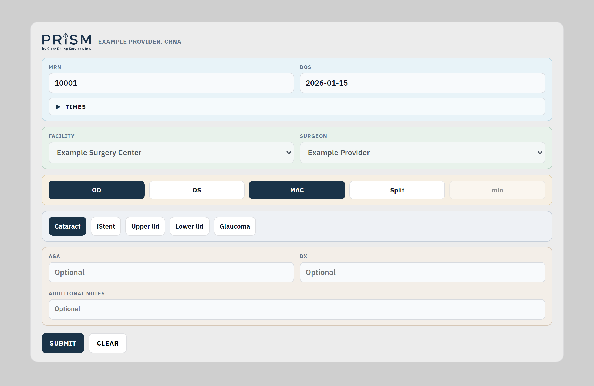
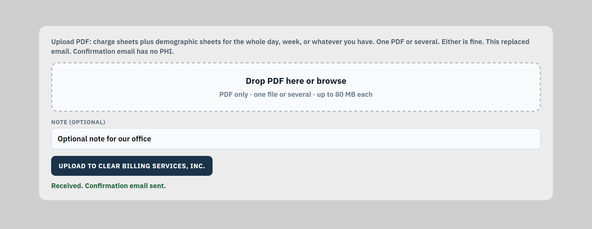

# ClearBilling · Prism Clinician Intake (Demo)

**Synthetic data only. Not for clinical use. Not connected to production PHI.**

Interactive GitHub Pages demo of **Prism**, the HIPAA-oriented clinician intake portal I designed and shipped at Clear Billing Services, Inc. as Director of Technical Operations.

## Open the demo

**https://brivera2005.github.io/clinician-mobile-intake/**

Or open [`index.html`](./index.html) locally.

---

## What Prism does

Prism is the **secure front door** for clinical charge data: invited clinicians, MFA, PHI acknowledgment, then either structured case entry or PDF upload instead of insecure email.

1. **Sign in** with an invited work email. Prism emails a single-use MFA login code (8-hour sessions).
2. **Accept the PHI screen**, then choose **How do you want to work today?**
3. **Add cases** (recommended): practice-tuned procedures, diagnoses, and form fields. Enter each case as you finish it, on phone, tablet, or computer.
4. **Or Upload PDF** (classic) for charge sheets plus demographic sheets for the day or week. One PDF or several. Through Prism instead of email.
5. Either path can **sync to that MRN or DOS**. Demographic sheets can arrive later.

**$49 / month.** Covers the Prism app, secure login, PHI screen, maintenance, dedicated hosting, power, uplink, and backups.

Production URL: `https://prism.clearbillingservices.com` (not this public demo).

## Screenshots

Each screenshot is synthetic, not a live example.

| | |
|---|---|
|  |  |
|  |  |

## Documentation

- [Provider guide (PDF)](docs/Prism-Provider-Guide.pdf) - practice-facing handout
- [HIPAA & security](docs/HIPAA-AND-SECURITY.md) - program + technical safeguards

## UL / LL

Lid procedures. Chips are labeled **UL** / **LL**. Add procedure is for anything else.

## Pair with Command Center

Downstream coding / operator desk:

- https://github.com/brivera2005/command-center-demo
- Operator guide: https://github.com/brivera2005/command-center-demo/blob/main/docs/OPERATOR_GUIDE.md
- Portfolio index: https://github.com/brivera2005/healthcare-portfolio

## Author

Benjamin M. Rivera · Director of Technical Operations · Clear Billing Services, Inc.  
LinkedIn: https://linkedin.com/in/brivera2005  
Email: brivera2005@gmail.com

## License

MIT
